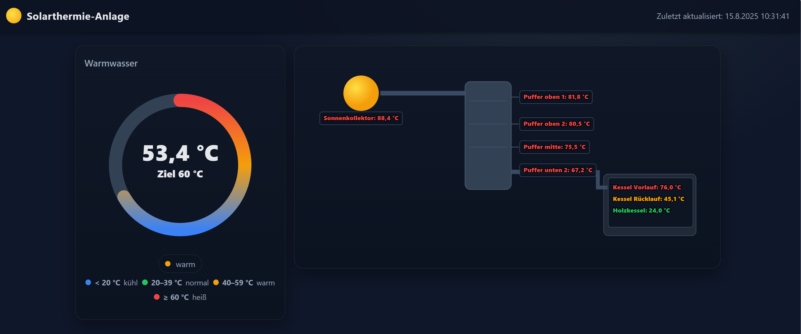

# Solarthermie Dashboard – UVR1611 + D-LOGG → Webinterface

Dieses Projekt liest **Temperatur- und Sensordaten** einer **Solarthermieanlage** über den **Technische Alternative D-LOGG (CAN-IO44 USB)** aus und stellt sie als **mobil-optimiertes Web-Dashboard** dar.  
Es unterstützt die **UVR1611** im **1DL-** und **2DL-Format** und kann auf einem Raspberry Pi oder jedem anderen System mit Python laufen.



## Funktionen

- **Live-Daten** direkt aus dem D-LOGG (UVR1611, 1DL & 2DL)
- **Sensor-Namen** individuell gemappt (z. B. „Warmwasser“ statt „T4“)
- **Mobilfreundliches** Webinterface mit Auto-Update alle 30 Sekunden
- Anzeige als **Kacheln** mit klaren °C-Werten
- Kann auf **Windows**, **Linux**, **Raspberry Pi** betrieben werden
- REST-API (`/api/current`) zur Weiterverarbeitung der Messwerte

## Hardware-Voraussetzungen

- **Technische Alternative D-LOGG** oder **CAN-IO44** mit USB-Ausgang
- UVR1611 (1DL oder 2DL-Modus)
- USB-Kabel
- Raspberry Pi (empfohlen Pi 3/4/5) **oder** PC mit Python

## Software-Voraussetzungen

- Python 3.8 oder neuer
- `pyserial`
- `flask`

## Installation

### 1. Repository klonen:
   ```bash
   git clone https://github.com/<dein-user>/solathermie-dashboard.git
   cd solathermie-dashboard
    ```
## 2. Abhängigkeiten installieren
```bash
pip install flask pyserial
```
### 3. Seriellen Port ermitteln:

- Windows: z. B. COM4 im Geräte-Manager
- Linux/Raspberry Pi: z. B. /dev/ttyUSB0

### 4. Anwendung starten:
```bash
python app.py --port COM4
```
oder
```bash
export DLOGG_PORT=/dev/ttyUSB0
python app.py
```
### 5. Dashboard im Browser öffnen
```bash
http://<IP_des_Geräts>:5000
```
 
### 6. API-Endpunkt
GET /api/current
Liefert aktuelle Messwerte als JSON:
```json
{
  "ok": true,
  "timestamp": "2025-08-09T12:30:00",
  "port": "COM4",
  "devices_found": 2,
  "values": {
    "Warmwasser": 52.3,
    "Puffer oben 1": 61.2,
    "Puffer unten 2": 45.6
  }
}

```
###  Anpassungen
Sensor-Namen im Python-Code (SENSOR_LABELS) ändern.

Update-Intervall (Default: 30 s) in index.html im JavaScript-Teil anpassen.

Weitere Kanäle wie Volumenstrom, Strahlung oder Ausgänge können einfach ergänzt werden.